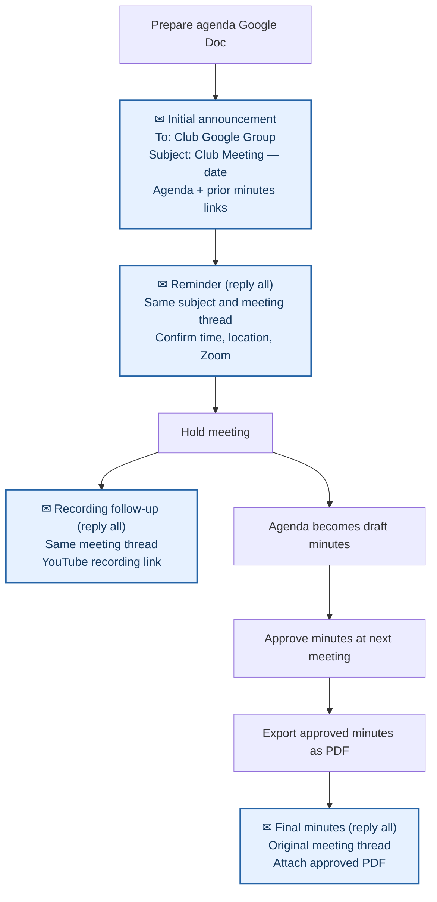
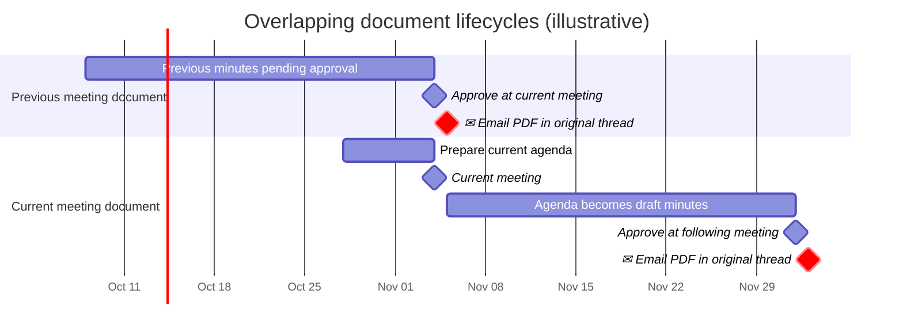

# Meeting Lifecycle and Announcements

This procedure connects [agenda preparation](agendas.md), announcements to members, the meeting itself, and [minutes](minutes.md).

## Meeting lifecycle at a glance



**Blue envelope boxes represent emails** to the club Google Group. Each meeting has one subject/thread; the reminder, recording link, and approved PDF are replies to that thread. The subject shown is an example, not a required naming format.

## Overlapping agenda and minutes timeline

Each meeting involves **two active working Google Docs**: the current meeting's agenda and the previous meeting's minutes awaiting approval. The current agenda becomes the next set of minutes after the meeting.

The chart uses **illustrative dates** for two consecutive meetings; actual meeting dates and preparation times vary.



At the **current meeting**, members approve the *previous* meeting's minutes while using the *current* agenda to conduct business. Afterward, the current agenda is renamed and completed as draft minutes, which are approved at the **following meeting**. Each approved PDF is emailed as an attachment in **its own original meeting thread**, not uploaded to Google Drive. The dates shown for PDF distribution are examples, not deadlines. **Red milestones** distinguish outgoing emails in this timeline; see the flowchart above for the example subject and reply-thread details.

## Suggested timeline

The following is **guidance rather than a set of hard deadlines**. Adapt to meeting changes, holidays, and when materials become available.

| When | Action |
| --- | --- |
| Before announcements | Prepare the [agenda](agendas.md), request officer and committee reports, and verify meeting arrangements. |
| Roughly one week before | Send the main announcement to the club Google Group. |
| Roughly one day before | Send a brief reminder, repeating access details and highlighting updates. |
| At the meeting | Bring the agenda and previous minutes; record proceedings and motions. |
| After the meeting, once available | Reply in the same meeting thread with the YouTube recording link. |
| After the meeting | Convert the working agenda Google Doc into draft minutes for approval at the next meeting. |
| At the following meeting | Review and approve the previous meeting's minutes, recording any corrections. |
| After approval | Export the finalized minutes as a PDF and **attach it** to a reply in the original meeting's email thread; do not upload the PDF to Google Drive. |

## Email the club Google Group

Use the **club Google Group** as the normal recipient for club-wide meeting announcements. Obtain the actual mailing address from the club's internal records; **do not publish or reproduce the full address in this public handbook**. This is the mailing list used in past club messages, not an instruction to email each member individually.

1. Open Gmail (or another email client) and start a message addressed to the club Google Group.
2. Write a subject that clearly identifies the club meeting and **actual date**; for example, `Club Meeting — November 4, 2026`. These are illustrative subjects, not a fixed naming convention. **Keep the same subject on replies** so the meeting's conversation remains together.
3. Confirm the **date, time, physical location, and remote-attendance arrangements** for this specific meeting. Do not assume last month's details are still correct.
4. Link the upcoming agenda (the working Google Doc that will become the minutes) and the previous meeting's minutes for review directly from Google Drive. Verify that each link opens the intended document and that intended recipients have appropriate access.
5. Include relevant meeting-specific details, such as potluck arrangements, if confirmed.
6. Proofread the date (including weekday), time, links, and recipient before sending.

### Keep one email thread per meeting

**Use a single Google Group conversation for each meeting.** Start the thread with the main announcement. Send the follow-up reminder, updated agenda links, Zoom details, post-meeting YouTube recording link, approved minutes PDF, and other meeting-specific follow-ups by **Reply all** to that original message, keeping the club Google Group in the recipients. Do not compose a new message for routine follow-ups, and do not change the subject just to say “Reminder.” Start a new thread for the next meeting.

Gmail generally keeps scheduled replies in their original conversation. However, **the initial announcement must be sent before a reply can be prepared against it**. Consequently, you cannot reliably schedule the initial message and its threaded follow-up as two independent new emails in advance and assume Gmail will join them later. If the original message has not been sent yet, schedule it first, then return after delivery to schedule a reply in that thread. Verify the recipient and conversation when preparing a scheduled reply.

### Schedule reminders in Gmail

**Best practice:** Use Gmail's **Schedule send** feature when meeting details are known in advance, while preserving the single-thread-per-meeting rule. This helps ensure that reminders are delivered promptly without relying on someone remembering to send them manually.

1. Prepare and schedule the **initial announcement** as a new email to the Google Group.
2. Review its contents and linked documents for accuracy, and confirm it is queued in Gmail's **Scheduled** folder.
3. Once that announcement has actually been sent, open the sent conversation and choose **Reply all**. Confirm the Google Group remains a recipient, then draft the follow-up reminder.
4. For each message, use Gmail's arrow beside **Send** → **Schedule send** and select the intended delivery time. As a general guide, target roughly **one week** and **one day** before the meeting respectively; these are flexible targets.
5. Check Gmail's **Scheduled** folder to confirm the relevant message is queued for the correct time. The follow-up can only be scheduled after the initial announcement is sent.
6. If the meeting time, venue, Zoom information, or documents change before delivery, review the scheduled messages and cancel or revise them as needed. Do not leave an outdated announcement queued.

Gmail scheduling is recommended, **not mandatory**: send directly when details are confirmed too late to schedule sensibly, or when an urgent correction or cancellation must reach members promptly. Scheduling a message does not replace checking its accuracy or confirming that it was sent.

### Main announcement: suggested contents

- A clear meeting date, start time, and venue/address.
- The current Zoom joining link or other remote-attendance instructions, **if applicable and verified**.
- A clickable link to the [agenda](agendas.md).
- A clickable link to the previous meeting's [minutes](minutes.md) for review and approval, if still pending.
- Other confirmed instructions, such as potluck details.

**Example outline** (replace all bracketed fields):

```text
To: [club Google Group]
Subject: SF Fil-Am Lions Club Meeting — [weekday, date]

Fellow Lions,

Our next club meeting is on [weekday, date] at [time].
Location: [venue and full address]
Remote attendance: [verified Zoom link/details, if applicable]

Meeting materials:
Agenda: [Google Drive link]
Previous meeting minutes for review: [Google Drive link]

[Other confirmed meeting details]

See you there!
[Sender / role]
```

The club's [Secretary Responsibilities Cheat Sheet](https://docs.google.com/document/d/165qGju1ZPAULRnlNKMzcoTDUj_ZjKSPmxse2m5eU7A0/edit) also includes an example announcement. Its specific venue and Zoom information should be rechecked rather than copied uncritically.

### Follow-up reminder

A short follow-up **around the day before** is a useful default. **Reply all in the existing meeting thread**, rather than composing a new email. Repeat the meeting date, time, location, remote-attendance information, and agenda link. Call out anything that changed since the initial announcement. Include the previous meeting's minutes link for review when relevant.

There is no need to force two messages on exact days. For example, if the first announcement goes out very close to the meeting, avoid sending a redundant reminder immediately afterward.

## Changes, rescheduling, and cancellation

The club has previously used the Google Group to announce postponed and cancelled meetings.

- **Changed time, venue, or remote link:** Reply all in the existing meeting thread with a clearly labeled update and corrected details and links.
- **Rescheduled meeting:** Reply all in the existing meeting thread and state both the original date and the new date/time.
- **Cancelled meeting:** Reply all in the existing meeting thread, leading the message body with **MEETING CANCELLED** and stating whether a replacement date is known. Avoid changing the subject if doing so would split the conversation.
- When practical, send a correction as soon as the change is confirmed rather than waiting for the next scheduled reminder. Check Gmail's **Scheduled** folder and cancel or revise any pending messages that contain superseded details.
- Check that any agenda or related meeting materials do not contradict the new announcement.

## At and after the meeting

The **agenda Google Doc becomes the minutes**: take notes in the agenda during the meeting, complete the record afterward, and rename that same document as the minutes. See [Meeting Minutes](minutes.md) for details.

### Share the meeting recording

Once the meeting recording is uploaded to YouTube and the link is ready, **Reply all** in that meeting's existing Google Group email thread with the recording link. Coordinate with whoever publishes the recording; see [Marketing: YouTube Meeting Recordings](../marketing/youtube.md). Verify that the link opens the correct recording and members can access it. Share it promptly once available; no exact turnaround time is required.

### Approve minutes at the following meeting

At the **next club meeting**, the previous meeting's minutes are reviewed and approved. Record any agreed corrections and update the working Google Doc. Until then, the minutes are **pending approval**, not final.

### Send the approved minutes PDF

**Only after approval**, export the finalized Google Doc as a **PDF** and verify its contents. Then **Reply all to the original meeting's Google Group email thread**, **attach the approved PDF directly**, and confirm the correct attachment is included before sending. **Do not upload the finalized PDF to Google Drive**; the working Google Doc remains in the club's meeting records.

This means the original meeting's thread may receive its final follow-up **after the following meeting**. The recording link is normally shared earlier, once available. Do not send a draft minutes document as the final minutes.

## Sources and examples

- [Secretary Responsibilities Cheat Sheet](https://docs.google.com/document/d/165qGju1ZPAULRnlNKMzcoTDUj_ZjKSPmxse2m5eU7A0/edit)
- [Club meeting announcement — October 2026](https://groups.google.com/d/msgid/SFFilAmLions/CAAvkWt8B6fjAqkOtoo-EwnduXmOK28AEZDukyPnqf%2BB5p_pDWw%40mail.gmail.com)
- [Club meeting cancellation — July 2026](https://groups.google.com/d/msgid/SFFilAmLions/CAOx0cbf8fTyP%3DVfZrog6a6%3DDr7iOid8K2x5S1z8rB9jYcnTNMQ%40mail.gmail.com)
