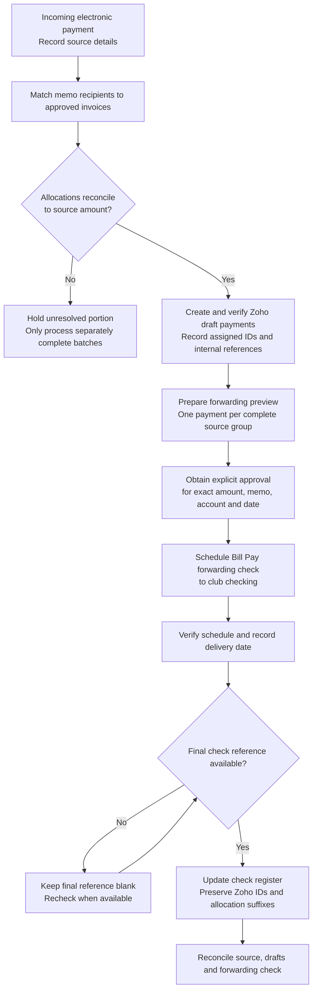

# Payments and forwarding

## Electronic payment forwarding lifecycle

This overview shows how an incoming electronic payment (including Zelle) moves from source reconciliation to the club's forwarding check. **A draft allocation is not a forwarding payment**, and no funds are forwarded without approval of the exact payment preview.

## Reconcile an electronic payment

1. Read the `{Lions Payments}` source row: date, status, sender, memo, amount, confirmation, and destination.
2. Match each person in the memo to an approved invoice and allocation. The allocation total must exactly equal the source payment.
3. If any name or remainder is unresolved, process only a separately complete and unambiguous batch.
4. Keep confirmation details in payment notes, not in a forwarding-check reference.

## Create draft payment allocations

1. Create one Zoho draft payment per approved allocation with the correct customer, amount, payment date, mode, invoice allocation, and traceable reference.
2. Use an internal reference pattern appropriate to the source, such as `Z#XXX`, `C#XXX`, or `C#PENDING X`. Do not use a bank confirmation or a Zoho payment identifier as a check number.
3. Capture the Zoho-assigned payment identifier after creation; do not predict it.
4. Update all related draft-payment notes with the complete approved allocation breakdown.
5. Verify customer, amount, date, payment mode, invoice allocation, reference, notes, and Draft status.
6. Update `{Check Register}` and the current-year action log with the verified internal references and payment identifiers.

## Prepare and schedule forwarding payments

1. Proceed only after the electronic-payment allocations are complete and reconciled.
2. Prepare one forwarding payment per complete source group. Do not combine unrelated transactions merely to reduce payment count.
3. Prepare a preview listing source group, amount, exact memo, `{Club Checking Account}`, and proposed delivery date.
4. Obtain explicit action-time approval for the exact preview.
5. Use `{Club Treasurer's Personal Account for Electronic Payments}` only as the approved intermediary for electronic payments. Schedule the Bill Pay forwarding check to the club using the approved funding account and memo.
6. Verify the scheduled payment's amount, memo, funding account, check-delivery method, and estimated delivery date.
7. Record the final check reference only when available. Retain both the accounting-system payment identifier and final forwarding reference in `{Check Register}`.

## Reconcile after scheduling

1. Record the confirmed delivery date for each in-scope source record.
2. Leave the final check-reference field blank until the provider supplies it.
3. Re-read the edited records and verify that excluded or unallocated rows remain unchanged.
4. Once the final reference is available, replace only the pending forwarding reference while preserving allocation suffixes and accounting-system identifiers.
5. Verify final register entries against the source payment, forwarding check, and Zoho drafts.

